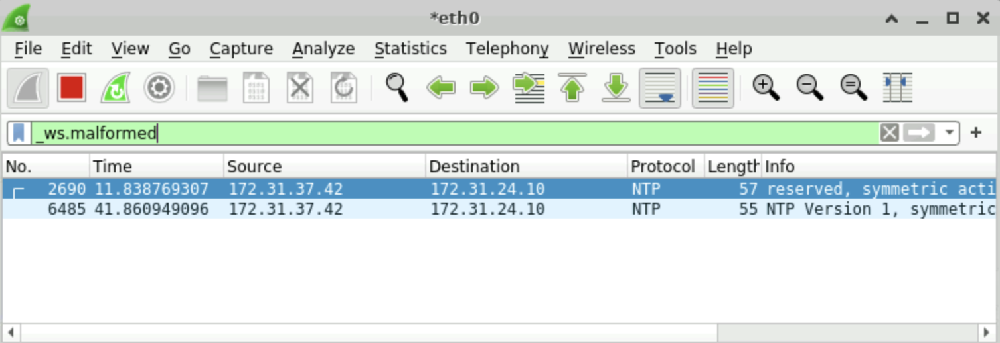
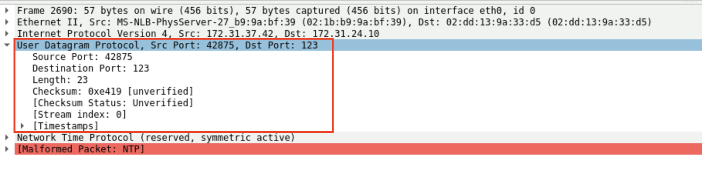
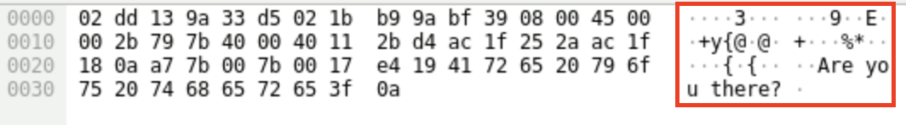

# Capturing and Filtering Packets with Wireshark
## Lab Description: In this challenge, you will capture and filter packets in real time with Wireshark.

You are under high alert ever since you found out that the Dark Kittens have infiltrated your network, yet again. One the company employees has complained of strange things happening on their work machine. Your job is to go in and determine if there's any suspicious network traffic on that computer.
First things first, though, we need to finish configuring Wireshark. 

1. Click on the **Applications** button in the top-left and open the **Terminal Emulator**.
2. In the console window, type `./wireshark-configure.sh` and select **Yes** at the prompt.
   
   **Note:** When you do this, you tell Wireshark that any user is allowed to capture packets on this machine. Normally, Wireshark is able to read pcap files without any additional configuration. We want to do our own captures, so this step is necessary.
3. Now let's open up Wireshark itself by going back to the **Applications** button, hovering over the **Internet** option, and selecting the **Wireshark** program.
4. Our goal is to start looking at traffic coming in and out of this specific machine, so we'll start by selecting the **eth0** device to look at the network traffic there.
5. As you can see, it starts filling up fast! We're looking for something anomalous that might point us to what those Dark Kittens are up to on the network. So in this particular instance, we're going to want to set up a filter and see if we can find them. Let's try specifically filtering for malformed packets. Type `_ws.malformed` in the filter bar and hit **enter**.
   
   **Analysis:** It might take a minute or two, but you should start to see some malformed packets coming in from **172.31.37.42**. What luck! That's a subnet within Globomantic's network. We might be on the right track. Let's take a deeper look at the packets themselves.
6. Examine the details in the pane below the packets, and you'll see that the malformed packets are coming in over UDP on port 123.
   
   **Analysis:** While that port number may seem suspicious, it's actually a common UDP port used for the Network Time Protocol. You can see that the details actually make reference to the protocol in the list there. But what about the malformed packet error? You'll see that the error actually makes reference to the Network Time Protocol and warns that the packet isn't coming through as expected. Suspicious!
7. Lastly, you can examine the contents of the packet itself in the pane at the very bottom.
   
   **Analysis:** Egads! It's a virtual message in a bottle! No wonder the packets are coming across as malformed. They're hiding communications in the packets themselves! Things like "Are you there?" or "I found you." are strange messages, indeed, and not something that you would find in normal traffic using NTP.

We've found some of their nefarious traffic, and now know where they might be hiding. In the next lab, we'll start investigating anything else strange that might be happening with the **172.31.37.42** IP address.
